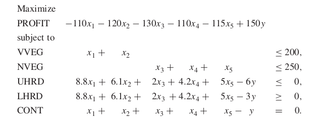
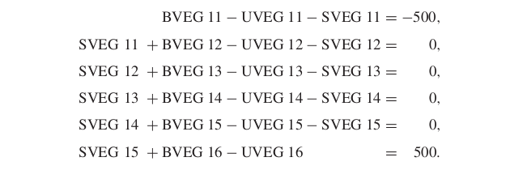

---
jupytext:
  cell_metadata_filter: -all
  formats: md:myst
  text_representation:
    extension: .md
    format_name: myst
    format_version: 0.13
    jupytext_version: 1.16.2
kernelspec:
  display_name: Python 3 (ipykernel)
  language: python
  name: python3
---

# Linear Optimization and the Simplex Method


## Linear Optimization

```{raw} html
<script src="https://cdnjs.cloudflare.com/ajax/libs/require.js/2.3.4/require.min.js"></script>
```

TODO: Write this section better and in more detail

I'm assuming LP is explained in the lectures already but here is a short reminder.

We want to solve problems that are of the form
```{math}
:label: lp_form

\begin{align*}
\maxi &c^\intercal x \\
\stf &Ax\leq b \\
&x\geq 0
\end{align*}
```
where $x\in\reals^n$ are the decision variables, $A\in\reals^{m\times n}$ and $b\in\reals^m$ specify the constraints, and $c\in\reals^n$ gives the linear objective.
LPs of other forms can be transformed into this form as well.
In the lectures, you probably learnt that an LP has a (bounded) optimal solution, then there exists an extreme point of the feasible region which is optimal.

Since at least one vertex is guaranteed to be the optimum, one can just go through every edge to find it.
The simplex algorithm does so, in an efficient way (most of the time).

## The Simplex Method

In order to describe the basic simplex algorithm, consider an objective function of the form 
```{math}
:label: lp_obj_form

a-c_1x_1-\dots-c_nx_n.
```
If we know that all {math}`x_i\geq 0`, then we can maximize it by setting all variables to $0$, giving us the optimal value as {math}`a`.
Thus the problem of optimizing {eq}`lp_form` becomes a problem of rewriting it in the form of {eq}`lp_obj_form`.

To exemplify this, consider the following LP

```{math}
:label: lp_example

\begin{align*}
\maxi &40x_1+60x_2 \\
\stf &2x_1+x_2\leq 7 \\
&x_1+x_2\leq 4 \\
&x_1+3x_2\leq 9 \\
&x_1,x_2\geq 0.
\end{align*}
```

The first step is to rewrite {eq}`lp_example` in the canonical form, where
- inequality constraints are converted to equality constraints by adding non-negative slack variables,
- all variables are non-negative
- the constraints are written so that the slack variables are left on one side.
%TODO complete

```{math}
\begin{align*}
\maxi &40x_1+60x_2 \\
\stf &x_3=7-2x_1-x_2 \\
&x_4=4-x_1-x_2 \\
&x_5=9-x_1-3x_2 \\
&x_1,x_2,x_3,x_4,x_5\geq 0.
\end{align*}
```

In the above, the set of (lone) variables in the LHS of the constraints (also called _basic_ variables) correspond to the vertices of the polyhedral that is the feasible region.
By substituting the _nonbasic_ variables in the LP with the basic ones, one is in effect iterating through the vertices of the feasible region, which will ultimately yield the optimal solution.

Actually doing so involves making decisions, for example which variable in the objective function to replace, and which constraint to rewrite it with.
For the purposes of this example, we'll first choose {math}`x_1`, and rewrite it using the **most limiting constraint**, which we obtain by posing the question "What is the largest value {math}`x_1` can have among the constraints?"

```{list-table}
:header-rows: 0

* - {math}`x_3=7-2x_1-x_2`
  - {math}`x_1\leq 3.5`
* - {math}`x_4=4-x_1-x_2 `
  - {math}`x_1\leq 4`
* - {math}`x_5=9-x_1-3x_2`
  - {math}`x_1\leq 9`
```

We can see that the most limiting constraint is {math}`x_3=7-2x_1-x_2`, so we solve for {math}`x_1` to get {math}`x_1=3.5-0.5x_2-0.5x_3`.
Substituting this to all {math}`x_1`s yields

```{math}
\begin{align*}
\maxi &40(3.5-0.5x_2-0.5x_3)+60x_2 \\
\stf &x_1=3.5-0.5x_2-0.5x_3\\
&x_4=4-(3.5-0.5x_2-0.5x_3)-x_2 \\
&x_5=9-(3.5-0.5x_2-0.5x_3)-3x_2 \\
&x_1,x_2,x_3,x_4,x_5\geq 0
\end{align*}
```

```{math}
\begin{align*}
\maxi &140+40x_2-20x_3 \\
\stf &x_1=3.5-0.5x_2-0.5x_3\\
&x_4=0.5-0.5x_2 +0.5x_3\\
&x_5=5.5-2.5x_2+0.5x_3 \\
&x_1,x_2,x_3,x_4,x_5\geq 0
\end{align*}
```

This completes a single iteration of the algorithm.
By repeating until no positive variable is left in the objective function, one obtains the entire algorithm.

## Visualization

The visualization below is obtained via [GILP](https://gilp.henryrobbins.com/en/latest/index.html).

`````{important}
These visualizations working require `require.js` as noted [here](https://jupyterbook.org/en/stable/interactive/interactive.html#plotly). 
However, the way to include them there puts this in every page, which is not necessary and potentially conflicting with other `js` frameworks (I couldn't get `d3` to work in {doc}`gradient`).
So make sure you add something like
````md
```{raw} html
<script src="https://cdnjs.cloudflare.com/ajax/libs/require.js/2.3.4/require.min.js"></script>
```
````
at the start of your page when using this.
`````

You can hover over the vertices to see additional information, such as the value of the objective function at that point (labeled **Obj**), or the basic variables associated with the vertex (labeled **B**).

```{code-cell}
import numpy as np

from gilp.simplex import LP
from gilp.visualize import simplex_visual

A = np.array([[2,1],
              [1,1],
              [1,3]])
b = np.array([7,4,9])
c = np.array([40, 60])

lp = LP(A,b,c)
simplex_visual(lp).show(renderer="notebook")
```

## More involved example

### Problem

Taken from {cite}`williams_model_2013` Chapter 12.1.

A food is manufactured by refining raw oils and blending them together. The
raw oils are of two categories:

```{list-table}
:header-rows: 0

* - Vegetable oils
  - VEG 1
* - 
  - VEG 2
* - Non-vegetable oils
  - OIL 1
* -
  - OIL 2
* -
  - OIL 3
```

Each oil may be purchased for immediate delivery (January) or bought on the
futures market for delivery in a subsequent month. Prices at present and in the
futures market are given below in (£/ton):

|          | VEG 1 | VEG 2 | OIL 1 | OIL 2 | OIL 3 |
|----------|-------|-------|-------|-------|-------|
| January  | 110   | 120   | 130   | 110   | 115   |
| February | 130   | 130   | 110   | 90    | 115   |
| March    | 110   | 140   | 130   | 100   | 95    |
| April    | 120   | 110   | 120   | 120   | 125   |
| May      | 100   | 120   | 150   | 110   | 105   |
| June     | 90    | 100   | 140   | 80    | 95    |

The final product sells at £150 per ton.

Vegetable oils and non-vegetable oils require different production lines for
refining. In any month, it is not possible to refine more than 200 tons of vegetable
oils and more than 250 tons of non-vegetable oils. There is no loss of weight in
the refining process, and the cost of refining may be ignored.

It is possible to store up to 1000 tons of each raw oil for use later. The cost
of storage for vegetable and non-vegetable oil is £5 per ton per month. The final
product cannot be stored, nor can refined oils be stored.

There is a technological restriction of hardness on the final product. In the
units in which hardness is measured, this must lie between 3 and 6. It is assumed
that hardness blends linearly and that the hardnesses of the raw oils are

```{list-table}
:header-rows: 0

* - VEG 
  - 8.8
* - VEG 2
  - 6.1
* -
  -
* - OIL 1
  - 2.0
* - OIL 2
  - 4.2
* - OIL 3
  - 5.0
```

What buying and manufacturing policy should the company pursue in order to
maximise profit?

At present, there are 500 tons of each type of raw oil in storage. It is required
that these stocks will also exist at the end of June.

### Modeling

The problem presented here has two aspects. Firstly, it is a series of simple
blending problems. Secondly, there is a purchasing and storing problem. To
understand how this problem may be formulated, it is convenient to consider
first the blending problem for only one month.

#### The single-period problem

If no storage of raw oils were allowed, the problem of what to buy and how to
blend in January could be formulated as follows:

% Didn't want to align properly so I just added a screenshot


The variables x 1 , x 2 , x 3 , x 4 , x 5 represent the quantities of the raw oils that should
be bought respectively, that is, VEG 1, VEG 2, OIL 1, OIL 2 and OIL 3. y
represents the quantity of PROD that should be made.

The objective is to maximize profit, which represents the income derived
from selling PROD minus the cost of the raw oils.

The first two constraints represent the limited production capacities for refin-
ing vegetable and non-vegetable oils.

The next two constraints force the hardness of PROD to lie between its upper
limit of 6 and its lower limit of 3. It is important to model these restrictions
correctly. A frequent mistake is to model them as

```{math}
8.8x_1+6.1x_2+2x_3+4.2+5x_5\leq 6
```
and
```{math}
8.8x_1+6.1x_2+2x_3+4.2+5x_5\geq 3
```
Such constraints are clearly dimensionally wrong. The expressions on the left
have the dimension of hardness multiplied by quantity, whereas the figures on
the right have the dimensions of hardness. Instead of the variables x i in the
above two inequalities, expressions x i /y are needed to represent proportions of
the ingredients rather than the absolute quantities x i . When such replacements
are made, the resultant inequalities can easily be re-expressed in a linear form as
the constraints UHRD and LHRD.

Finally, it is necessary to make sure that the weight of the final product PROD
is equal to the weight of the ingredients. This is done by the last constraint CONT,
which imposes this continuity of weight.

The single-period problems for the other months would be similar to that for
January apart from the objective coefficients representing the raw oil costs.

#### The multi-period problem

The decisions of how much to buy each month with a view to storing for use
later can be incorporated into a linear programming model. To do this, a ‘multi-
period’ model is built. It is necessary, each month, to distinguish the quantities
of each raw oil bought, used and stored. These quantities must be represented by
different variables. We suppose the quantities of VEG 1 bought, used and stored
in each successive month are represented by variables with the following names:

```{list-table}
:header-rows: 0

* - BVEG 11,
  - BVEG 12,
  - and so on,
* - UVEG 11,
  - UVEG 12,
  - Und so on,
* - SVEG 11,
  - SVEG 12,
  - and so on.
```

It is necessary to link these variables together by the relation
```{math}
\text{quantity stored in month }(t-1) + \text{quantity bought in month }t

= \text{quantity used in month }t + \text{quantity stored in month }t
```

Initially (month 0) and finally (month 6), the quantities in store are constants
(500). The relation above involving VEG 1 gives rise to the following constraints:


Similar constraints must be specified for the other four raw oils.

It may be more convenient to introduce variables SVEG 10, and so on, and
SVEG 16, and so on, into the model and fix them at the value 500.

In the objective function, the ‘buying’ variables will be given the appropriate
raw oil costs in each month. The storage variables will be given the cost of £5
(or ‘profit’ of –£5). Separate variables PROD 1, PROD 2, and so on, must be
defined to represent the quantity of PROD to be made in each month. These
variables will each have a profit of £150.

The resulting model will have the following dimensions as well as the single
objective function:
|                       |                   |
|----------------------:|-------------------|
|  {math}`6\times 5=30` | buying variables  |
|  {math}`6\times 5=30` | using variables   |
|  {math}`6\times 5=30` | storing variables |
|                     6 | product variables |
|              Total 91 | variables         |

```{list-table}
:header-rows: 0

* - {math}`6\times 5=30`
  - blending constraints
* - {math}`6\times 5=30`
  - storage linking constraints
* - Total 60
  - constraints
```

It is also important to realize the use to which a model such as this might
be put for medium-term planning. By solving the model in January, buying and
blending plans could be determined for January together with provisional plans
for the succeeding months. In February, the model would probably be resolved
with revised figures to give firm plans for February together with provisional
plans for succeeding months up to and including July. By this means, the best
use is made of the information for succeeding months to derive an operating
policy for the current month.

### Solving

I'm solving this in Python because the visualisations above are in Python.
We can separate the pages and adapt if desired.

I must have entered something wrong because the profit doesn't match what is given in the book.
I blame not using a nice modeling language.
For the final version of an example like this, it is probably better to use JuMP or a modeling framework in Python.
The question is which (probably JuMP, since we can't have both as executable).
Also, if JuMP, then how often would we use GILP visualisations? Since we can't have two languages in one file.

```{code-cell} python
import numpy as np
import pandas as pd
from scipy.optimize import linprog
```

```{code-cell} python
# in (month x oil) shape
oil_costs = np.array([[110, 120, 130, 110, 115],
                      [130, 130, 110,  90, 115],
                      [110, 140, 130, 100,  95],
                      [120, 110, 120, 120, 125],
                      [100, 120, 150, 110, 105],
                      [ 90, 100, 140,  80, 135]])

# let x be of the form (buying_vars, using_vars, storing_vars, product_vars)
# where x_vars is ordered (month1_oil1, month1_oil2, ..., month2_oil1, ...)
# and len(x)=91

# linprog minimizes, so c@x should be negative profits
c = -np.concatenate((-oil_costs.flatten(),  # cost of buying
                     np.zeros(30),          # using variables doesn't affect objective
                     np.full(25, -5),       # cost of storing
                     np.full(6, 150)))      # profit

## Equality constraints

A_storage = np.zeros((30, 91))
b_storage = np.array((-500,0,0,0,0,500)*5)
for oil in range(5):
    # do january
    A_storage[oil*6, (oil, 30+oil, 60+oil)] = (1,-1,-1)
    for month in range(1, 5): # do middle months
        A_storage[oil*6+month, (60+(month-1)*5+oil, month*5+oil, 30+month*5+oil, 60+month*5+oil)] = (1, 1,-1,-1)
    # do june
    A_storage[oil*6+5, (60+(5-1)*5+oil, 5*5+oil, 30+5*5+oil)] = (1, 1,-1)

A_continuity = np.zeros((6, 91))
b_continuity = np.zeros(6)
for month in range(6):
    A_continuity[month, 30+month*5:30+(month+1)*5] = 1
    A_continuity[month, 85+month] = -1

A_eq = np.vstack((A_storage, A_continuity))
b_eq = np.concatenate((b_storage, b_continuity))

## Inequality constraints (should be upper bounds)
A_production = np.zeros((12,91))
b_production = np.array((200, 250)*6)
A_hardness = np.zeros((12,91))
b_hardness = np.zeros(12)
for month in range(6):
    A_production[month*2, 30+month*5:30+month*5+2] = 1  # for vegetable oils
    A_production[month*2+1, 30+month*5+2:30+(month+1)*5] = 1  # for non-vegetable oils

    A_hardness[month*2, 30+month*5:30+(month+1)*5] = (8.8, 6.1, 2, 4.2, 5)  # upper limit
    A_hardness[month*2+1, 30+month*5:30+(month+1)*5] = (-8.8, -6.1, -2, -4.2, -5)  # lower limit (expressed as an upper bound)
    A_hardness[month*2:(month+1)*2, 85+month] = (-6, 3)

A_ub = np.vstack((A_production, A_hardness))
b_ub = np.concatenate((b_production, b_hardness))

# variable bounds
## only storing variables have a bound of 1000, the rest is controlled by constraints
bounds = [(0,None)]*60 + [(0,1000)]*25 + [(0,None)]*6
```

```{code-cell}
res = linprog(c, A_ub, b_ub, A_eq, b_eq, bounds)
print(f"Profit=${-np.round(res.fun)}")
```

**Purchase Plan**
```{code-cell}
rows = ['Jan', 'Feb', 'Mar', 'Apr', 'May', 'Jun']
columns = ['VEG1', 'VEG2', 'OIL1', 'OIL2', 'OIL3']
purchase_plan = pd.DataFrame(columns=columns, index=rows, data=0.0)

for month in range(6):
    for oil in range(5):
        purchase_plan.iloc[month, oil] = np.round(res.x[month*5+oil],1)
purchase_plan
```

**Monthly Consumption**
```{code-cell}
monthly_consumption = pd.DataFrame(columns=columns, index=rows, data=0.0)

for month in range(6):
    for oil in range(5):
        monthly_consumption.iloc[month, oil] = np.round(res.x[30+month*5+oil],1)
monthly_consumption
```

**Inventory Plan**
```{code-cell}
inventory_plan = pd.DataFrame(columns=columns, index=rows[:-1], data=0.0)

for month in range(5):
    for oil in range(5):
        inventory_plan.iloc[month, oil] = np.round(res.x[60+month*5+oil],1)
inventory_plan
```


### Solving with OR-Tools

This solution seems to be correct.

```{code-cell} python
from ortools.linear_solver import pywraplp
solver = pywraplp.Solver.CreateSolver("GLOP")
if not solver:
    raise Exception("Couldn't create solver")

hardness = [8.8, 6.1, 2, 4.2, 5]
```

```{code-cell} python
buying = [[solver.NumVar(0, solver.infinity(), f"B-{month}-{oil}") for oil in columns] for month in rows]
using = [[solver.NumVar(0, solver.infinity(), f"U-{month}-{oil}") for oil in columns] for month in rows]
storing = [[solver.NumVar(0, 1000, f"S-{month}-{oil}") for oil in columns] for month in rows[:-1]]
product = [solver.NumVar(0, solver.infinity(), f"P-{oil}") for month in rows]

print("Number of variables =", solver.NumVariables())

# storage constraints
for oil in range(5):
    # do january
    solver.Add(buying[0][oil] - using[0][oil] - storing[0][oil] == -500)
    for month in range(1, 5): # do middle months
        solver.Add(storing[month-1][oil] + buying[month][oil] - using[month][oil] == storing[month][oil])
    # do june
    solver.Add(storing[4][oil] + buying[5][oil] - using[5][oil] == 500)


for month in range(6):
    solver.Add(sum(using[month]) == product[month])  # continuity

    solver.Add(sum(using[month][:2]) <= 200)
    solver.Add(sum(using[month][2:]) <= 250)

    solver.Add(sum(hardness[oil]*using[month][oil] for oil in range(5)) <= 6*product[month])
    solver.Add(sum(hardness[oil]*using[month][oil] for oil in range(5)) >= 3*product[month])

print("Number of constraints =", solver.NumConstraints())

cost_of_purchase = sum(oil_costs[month][oil]*buying[month][oil] for oil in range(5) for month in range(6))
cost_of_storage = 5*sum(sum(x) for x in storing)
revenue = 150*sum(product)
solver.Maximize(revenue - cost_of_purchase - cost_of_storage)
```

```{code-cell}
def p(x, m=6):
    for month in range(m):
      for oil in range(5):
        print(f"{x[month][oil]} = {x[month][oil].solution_value()}")

status = solver.Solve()
if status == pywraplp.Solver.OPTIMAL:
    print("Solution:")
    print(f"Objective value = {solver.Objective().Value():0.1f}")
    p(buying)
    p(using)
    p(storing, 5)
    for month in range(6):
        print(f"{product[month]} = {product[month].solution_value()}")
    print(solver)
else:
    print("The problem does not have an optimal solution.")
```

```{code-cell}
import pandas as pd

from ortools.linear_solver import pywraplp


# Define input data
prices = pd.DataFrame(
    index=["January", "February", "March", "April", "May", "June"],
    data={
        "VEG 1": [110, 130, 110, 120, 100,  90],
        "VEG 2": [120, 130, 140, 110, 120, 100],
        "OIL 1": [130, 110, 130, 120, 150, 140],
        "OIL 2": [110,  90, 100, 120, 110,  80],
        "OIL 3": [115, 115,  95, 125, 105, 135],
    },
)
hardness = [8.8, 6.1, 2.0, 4.2, 5.0]
price_per_ton = 150
storage_cost_per_ton_per_month = 5
storage_limit = 1000
hardness_lower_bound = 3
hardness_upper_bound = 6
initial_storage_amount = 500
final_storage_amount = 500
maximum_vegetable_refinement_per_month = 200
maximum_non_vegetable_refinement_per_month = 250


if __name__ == "__main__":

    # Create solver
    solver = pywraplp.Solver.CreateSolver("GLOP")

    # Index sets
    I = range(0, prices.shape[1])  # oils
    J = range(0, prices.shape[0])  # months

    # Upper bounds
    upper_bound_x = max(maximum_vegetable_refinement_per_month, maximum_non_vegetable_refinement_per_month)
    upper_bound_b = storage_limit + upper_bound_x
    upper_bound_y = maximum_vegetable_refinement_per_month + maximum_non_vegetable_refinement_per_month

    # Define variables
    x = [[solver.NumVar(0, upper_bound_x, f"x_{i}{j}") for j in J] for i in I]  # amount of oil i to be refined in month j
    b = [[solver.NumVar(0, upper_bound_b, f"b_{i}{j}") for j in J] for i in I]  # amount of oil i to be bought in month j
    s = [[solver.NumVar(0, storage_limit, f"s_{i}{j}") for j in J] for i in I]  # amount of oil i in storage at the end of month j
    y = [solver.NumVar(0, upper_bound_y, f"y_{j}") for j in J]  # production in month j
    print("Number of variables =", solver.NumVariables())

    # At most 200 tons of vegetable oils refined per month
    for j in J:
        solver.Add(x[0][j] + x[1][j] <= maximum_vegetable_refinement_per_month)

    # At most 250 tons of non-vegetable oils refined per month
    for j in J:
        solver.Add(x[2][j] + x[3][j] + x[4][j] <= maximum_non_vegetable_refinement_per_month)

    # Amount of product produced in month j
    for j in J:
        solver.Add(sum(x[i][j] for i in I) == y[j])

    # Hardness lower bound fulfilled
    for j in J:
        solver.Add(sum(hardness[i] * x[i][j] for i in I) >= hardness_lower_bound * y[j])

    # Hardness upper bound fulfilled
    for j in J:
        solver.Add(sum(hardness[i] * x[i][j] for i in I) <= hardness_upper_bound * y[j])

    # Exactly 500 of each type remaining at the end of june
    for i in I:
        solver.Add(s[i][5] == final_storage_amount)

    # Storage at the end of a month is consistent with the initial storage, the amount bought and the amount refined
    for i in I:
        for j in J:
            if j > 0:
                solver.Add(s[i][j] == s[i][j-1] + b[i][j] - x[i][j])

    # Storage at the end of January is consistent with initial storage of 500 of each type
    for i in I:
        solver.Add(s[i][0] == initial_storage_amount + b[i][0] - x[i][0])

    # Objective function
    material_costs = sum(prices.iloc[j].iloc[i] * b[i][j] for i in I for j in J)
    storage_costs = storage_cost_per_ton_per_month * sum(s[i][j] for i in I for j in J)
    revenues = price_per_ton * sum(y[j] for j in J)
    objective = revenues - material_costs - storage_costs
    solver.Maximize(objective)

    # Solve the program
    status = solver.Solve()

    # Check if a solution was found
    if status == pywraplp.Solver.OPTIMAL:
        print('Solution:')
        print('Objective value =', solver.Objective().Value())
        for i in I:
            for j in J:
                print(f'x_{i}{j} =', x[i][j].solution_value())
        print(solver)
    else:
        print('The problem does not have an optimal solution.')

```